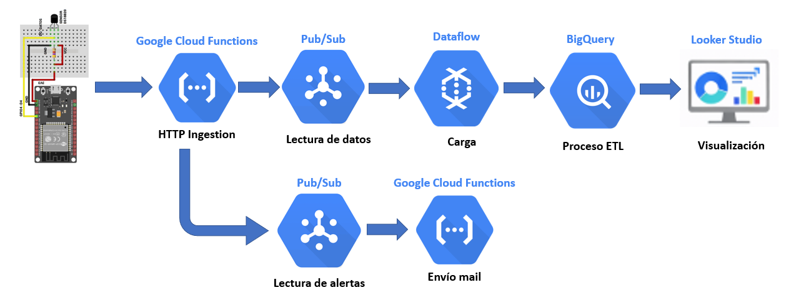

# ⭐ IoT Cold Chain Analytics Pipeline
### Arquitectura en GCP

[](https://databricks.com/)
[](https://azure.microsoft.com/)
[](https://spark.apache.org/)
[](https://delta.io/)
[](https://powerbi.microsoft.com/)
[](https://github.com/features/actions)

*Pipeline de datos en tiempo real para monitoreo de temperatura en sensores IoT utilizando arquitectura serverless y procesamiento streaming.*

</div>

## ▶️ Diagrama:




## 🎯 Descripción

📄 IoT Cold Chain Analytics Pipeline es un proyecto de ingeniería de datos orientado al monitoreo en tiempo real de sensores de temperatura mediante dispositivos IoT basados en ESP32.

Los sensores capturan datos de temperatura y los envían a la nube a través de un endpoint HTTP. Estos eventos son ingeridos en Google Cloud Functions, publicados en un sistema de mensajería Pub/Sub, procesados en streaming mediante Dataflow, almacenados en BigQuery, y finalmente visualizados en dashboards interactivos en Looker Studio.

El objetivo del proyecto es simular un escenario industrial como:
- Monitoreo de cadena de frío
- Sensores en almacenes o transporte refrigerado
- Supervisión de temperatura en tiempo real

El pipeline permite detectar anomalías de temperatura, almacenar históricos de medición y habilitar análisis analíticos y dashboards operacionales.

</div>

## ⚙️ ¿Por qué usar esta arquitectura?

La arquitectura Cloud Function → Pub/Sub → Dataflow → BigQuery → Looker Studio fue diseñada para resolver los principales desafíos de sistemas IoT industriales:

| Tecnología          | Razón de uso                                                                                                                    |
| ------------------- | ------------------------------------------------------------------------------------------------------------------------------- |
| **Cloud Functions** | Permite recibir datos desde sensores vía HTTP sin administrar servidores. Es ideal para eventos generados por dispositivos IoT. |
| **Pub/Sub**         | Actúa como un buffer desacoplado que soporta millones de eventos por segundo y permite escalar el sistema sin perder mensajes.  |
| **Dataflow**        | Motor de procesamiento streaming basado en Apache Beam que permite limpiar, transformar y enriquecer datos en tiempo real.      |
| **BigQuery**        | Data Warehouse serverless optimizado para análisis analítico sobre grandes volúmenes de datos históricos.                       |
| **Looker Studio**   | Plataforma de visualización que permite construir dashboards operacionales conectados directamente a BigQuery.                  |


**Ventajas principales de esta arquitectura**

📡 Procesamiento en tiempo real

⚡ Alta escalabilidad para miles de sensores

🧩 Arquitectura desacoplada

☁️ 100% serverless

📊 Analytics-ready

## 🏛️ Arquitectura

### ➡️ Flujo de Datos Principal

```
🌡️ Sensor IoT (ESP32)
        ↓
☁️ Cloud Function (HTTP Ingestion)
        ↓
📨 Pub/Sub Topic
        ↓
⚡ Dataflow Streaming Pipeline
        ↓
🗄️ BigQuery (Data Warehouse)
        ↓
📊 Looker Studio Dashboard
```

### ➡️ Flujo de Datos En Paralelo

```
☁️ Cloud Function (HTTP Ingestion)
        ↓
📨 Pub/Sub Topic (temperature-alerts)
        ↓
☁️ Cloud Function
        ↓
📩 Notificación de alerta
```

### 📦 Componentes del Pipeline

<table> <tr> <td width="33%" valign="top">
🌡️ IoT Layer 

Propósito: Captura de datos

Componentes

ESP32

Sensor de temperatura DS18B20

Características

✅ Lectura de temperatura

✅ Envío de datos vía HTTP

✅ Intervalo configurable de envío

✅ Identificación de dispositivo (device_id)

</td> <td width="33%" valign="top">
☁️ Ingestion Layer

Propósito: Recepción de eventos

Servicios

Cloud Functions

Pub/Sub

Características

✅ Recepción HTTP de sensores

✅ Validación de payload

✅ Publicación en tópico Pub/Sub

✅ Arquitectura desacoplada

</td> <td width="33%" valign="top">
⚡ Processing Layer

Propósito: Transformación streaming

Servicios

Dataflow

Características

✅ Procesamiento en tiempo real

✅ Limpieza de datos

✅ Agregado de timestamps

✅ Validación de rangos de temperatura

✅ Preparación para análisis

</td> </tr> </table>

---

## 📊 Analytics Layer

**Servicio principal:** BigQuery

**Propósito:** almacenamiento analítico y consultas de alto rendimiento.

**Características**
📈 Análisis histórico de temperatura
📊 Detección de anomalías
⏱️ Análisis temporal de sensores
📉 Monitoreo de cadena de frío

Los datos son consumidos directamente por Looker Studio para generar dashboards operacionales.

---

## 📊 Dashboard

Looker Studio permite visualizar:
- Temperatura en tiempo real
- Histórico de sensores
- Alertas por temperaturas fuera de rango
- Comparativa entre dispositivos

BigQuery → Looker Studio → Dashboard IoT

---

## 📁 Estructura del Proyecto

```
iot-coldchain-pipeline/
│
├── 📂 cloud_function/
│   └── ingest_sensor_data.py        # Endpoint HTTP para sensores
│
├── 📂 dataflow/
│   └── streaming_pipeline.py        # Pipeline de procesamiento
│
├── 📂 esp32/
│   └── main.py                      # Código del sensor
│
├── 📂 dashboard/
│   └── looker_dashboard.png
│
├── 📂 arquitectura/
│   └── arquitectura_pipeline.png
│
└── 📄 README.md
```

---
## ⚙️ Requisitos Previos

- ☁️ Cuenta en Google Cloud
- 🔐 Proyecto GCP configurado
- 📡 Tópico Pub/Sub creado
- ⚡ Pipeline Dataflow configurado
- 🗄️ Dataset en BigQuery
- 📊 Dashboard en Looker Studio
- 🌡️ Dispositivo ESP32 + sensor DS18B20
---

## 🚀 Descripción del proceso

### 1️⃣. Creo los topics que voy a utilizar


### 2️⃣. Creo los Cloud Run Functions que voy a utilizar


### 3️⃣. Creo la conexion en el ESP-32 y cargo el codigo.


### 4️⃣. El Cloud Function "sd-iotcoldchain" ya esta programado para hacer las publicaciones


### 5️⃣. Para el flujo principal ejecutamos dataflow_pipeline.py (antes creamos el bucket bucket_coldchain) 


### 6️⃣. En BigQuery creamos la tabla bronze y las vistas silver y golden


### 7️⃣. En Looker Studio creamos la dashboard 


### 8️⃣. Para el caso del flujo paralelo, "temperature-alerts" captura las temperaturas fuera del rango y "temperature-alert-email" envia un correo


---


